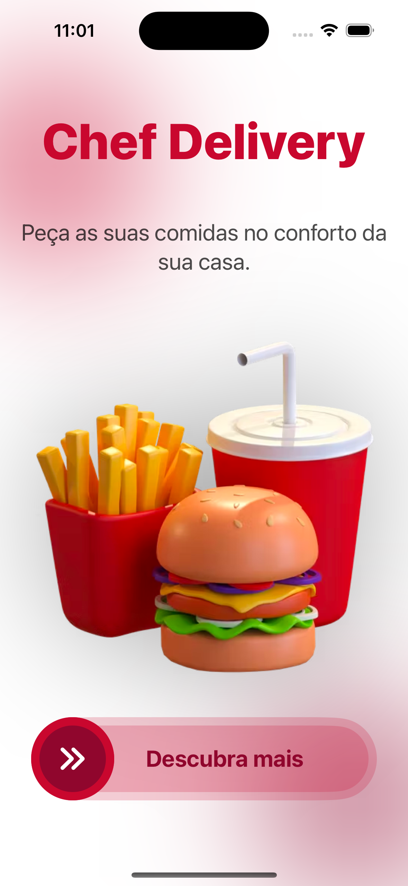
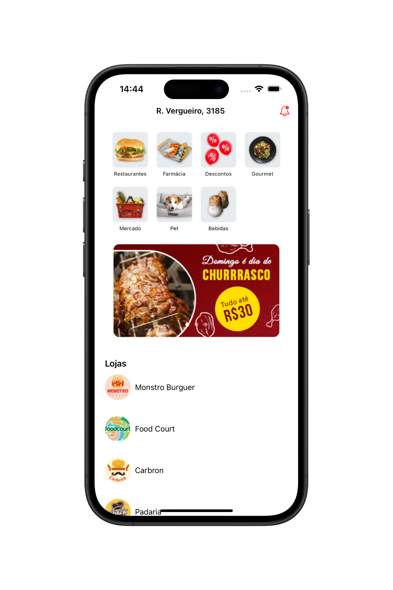
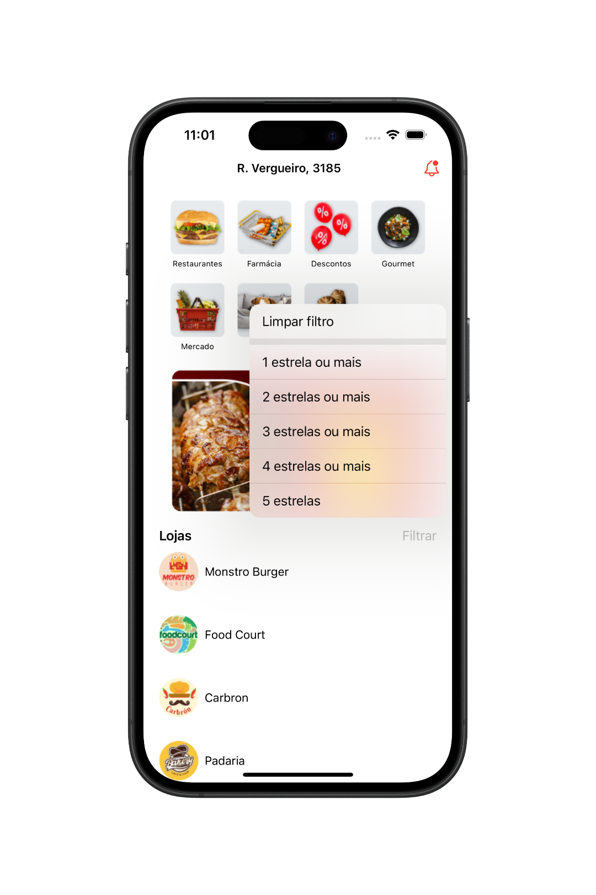
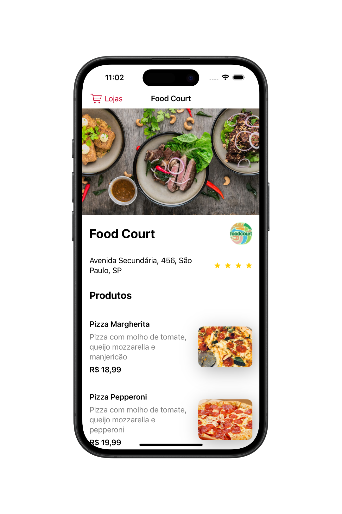
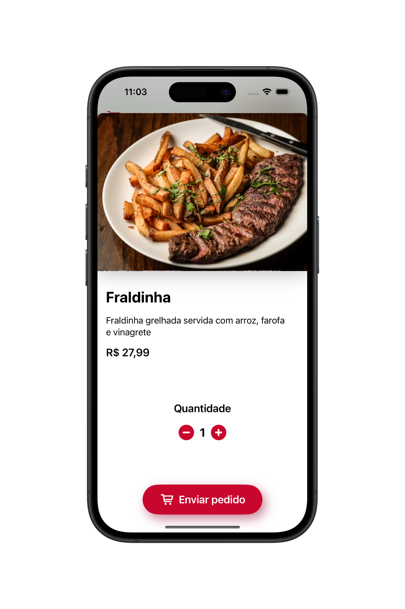
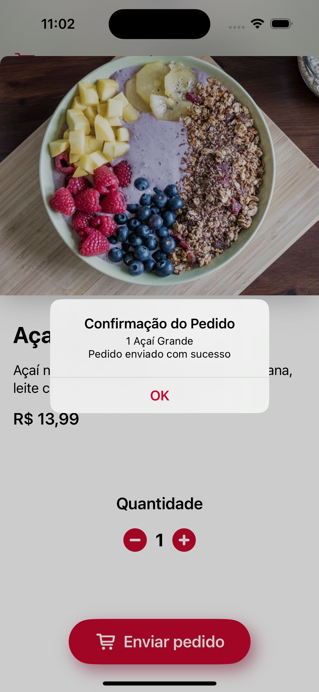
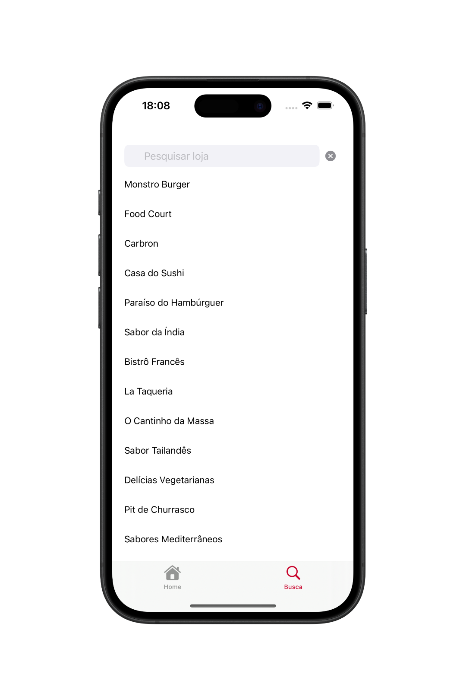
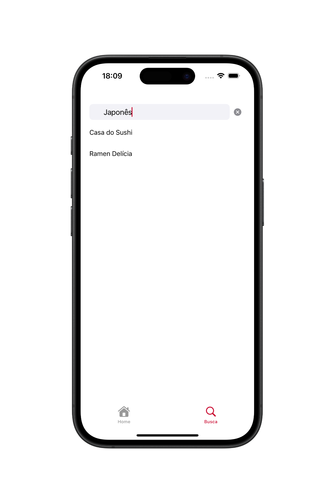

# 📱 Chef Delivery - App de Entrega

O **Chef Delivery** é um aplicativo de delivery fictício desenvolvido com **SwiftUI**, com foco em interface moderna e experiência fluida. Ele exibe categorias de produtos, banners promocionais e uma lista de lojas com sistema de filtro por avaliação. Ao selecionar uma loja, o usuário é direcionado para a tela de detalhes, onde pode visualizar o endereço, avaliação e cardápio disponível. Os pedidos podem ser feitos diretamente na tela do produto.

  
  
  
  
  
  
  
  

## 🛠 Tecnologias Utilizadas

- Swift  
- SwiftUI  
- Componentização
- MVC (Model-View-Controller) 
- Mock de Dados
- URLSession e Alamofire (Async/Await e CompletionHandler)
- API REST (Via Apiary GET e POST)
- Dependência Externa Via SPM (Alamofire)

## 👨🏻‍💻 Como Usar o Aplicativo

- Baixe o projeto e abra com o Xcode.
- Execute o aplicativo em um simulador iOS ou iPhone físico.
- Na tela inicial, deslize o botão para acessar a **Home**.
- Explore as categorias, banners e lista de lojas disponíveis.
- Utilize o filtro para visualizar lojas com base em sua avaliação.
- Toque em uma loja para visualizar os detalhes e o cardápio.
- Selecione um produto, ajuste a quantidade desejada e envie seu pedido.

## 📌 Observações

Este projeto foi desenvolvido com fins **educacionais**, como prática de desenvolvimento iOS moderno utilizando **SwiftUI** e uma arquitetura leve baseada em **MVC**. O aplicativo integra com uma **API REST**, criada com o **Apiary**, e realiza requisições tanto do tipo **GET** (para listagem de dados) quanto **POST** (para envio de pedidos), utilizando `URLSession` e `Alamofire` com suporte a `async/await` e `completion handler`. Além disso, parte dos dados também pode ser simulada localmente via mocks, o que facilita testes e desenvolvimento.
