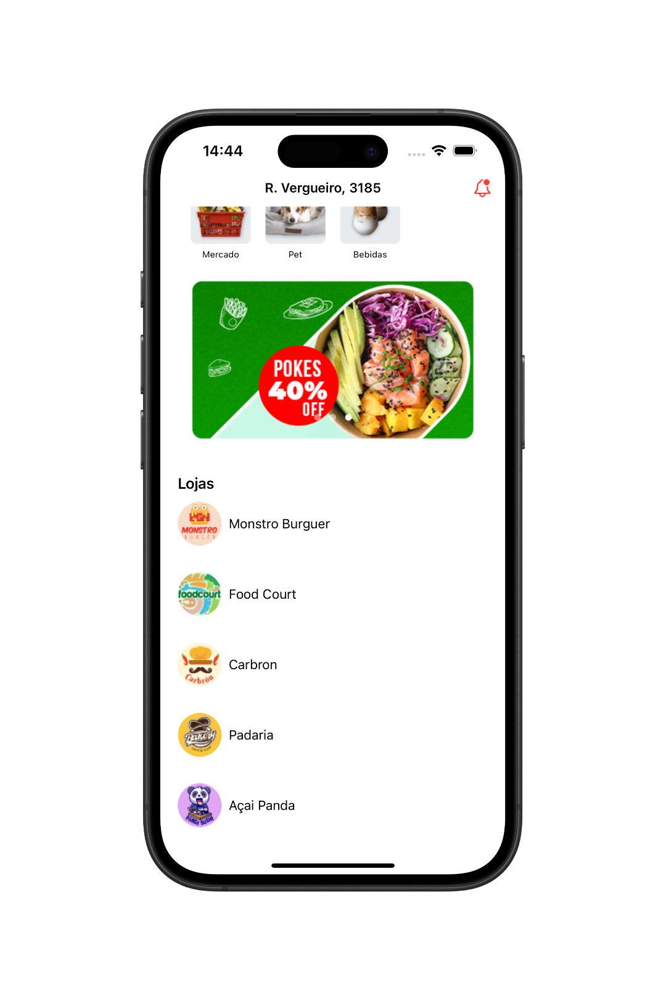

# 📱 Chef Delivery - App de Entrega

O **Chef Delivery** é um aplicativo desenvolvido com **SwiftUI**, que simula um app de delivery. Ele apresenta as categorias de pedidos, banners promocionais e uma lista de lojas com uma interface moderna e responsiva.

  
  

## 🛠 Tecnologias Utilizadas

- Swift  
- SwiftUI  
- Componentização
- MVVM (Model-View-ViewModel) 
- Mock de Dados

## 👨🏻‍💻 Como Usar o Aplicativo

- Baixe o projeto e abra com o Xcode.
- Execute o aplicativo em um simulador iOS ou iPhone físico.
- Navegue pela tela home para visualizar:
  - Categorias de pedidos
  - Banners promocionais
  - Lojas disponíveis

## 📌 Observação

Este projeto foi desenvolvido com fins educacionais como prática de desenvolvimento iOS moderno utilizando **SwiftUI** e uma estrutura leve baseada em **MVVM**. Já os dados estão mocados com arrays locais em arquivos **Swift**.
